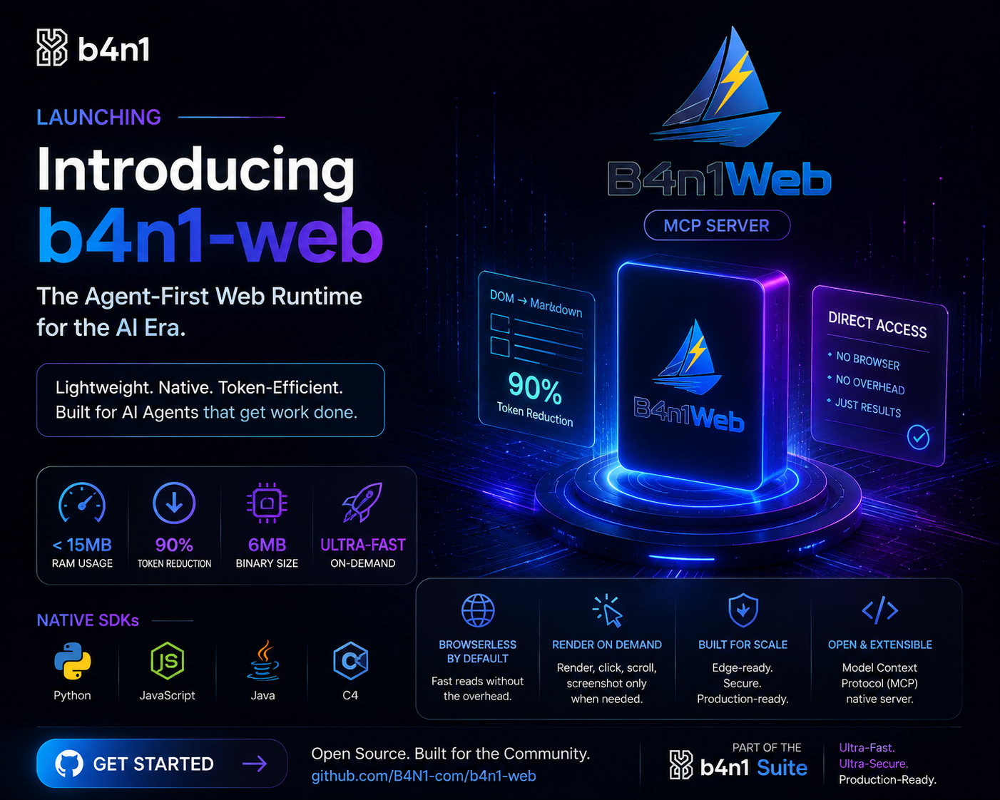

<div align="center">



# 🌐 B4n1Web — Agentic Browser Engine

**Ultra-lightweight headless browser for AI agents.**

[](LICENSE)
[](https://pypi.org/project/b4n1-web/)
[](https://www.npmjs.com/package/b4n1-web)
[](https://www.nuget.org/packages/B4n1Web)
[](https://central.sonatype.com/artifact/com.b4n1/b4n1-web)
[](https://B4N1-com.github.io/b4n1-web/)

[](https://pypi.org/project/b4n1-web/)
[](https://www.npmjs.com/package/b4n1-web)
[](https://www.nuget.org/packages/B4n1Web)
[](https://github.com/B4N1-com/b4n1-web/releases)
[](https://github.com/B4N1-com/b4n1-web/releases)

Single Rust binary · 4 language SDKs · 33 MCP tools.
Navigate URLs, extract structured content (markdown, links, screenshots), and build autonomous agent workflows.

</div>

---

## 🌍 Languages / Idiomas / 语言

|  |  |  |  |  |  |
|--|--|--|--|--|--|
| 🇬🇧 [English](README.md) | 🇪🇸 [Español](i18n/README.es.md) | 🇫🇷 [Français](i18n/README.fr.md) | 🇩🇪 [Deutsch](i18n/README.de.md) | 🇵🇹 [Português](i18n/README.pt-BR.md) | 🇮🇹 [Italiano](i18n/README.it.md) |
| 🇨🇳 [简体中文](i18n/README.zh-CN.md) | 🇯🇵 [日本語](i18n/README.ja.md) | 🇰🇷 [한국어](i18n/README.ko.md) | 🇷🇺 [Русский](i18n/README.ru.md) | 🇸🇦 [العربية](i18n/README.ar.md) | 🇮🇳 [हिन्दी](i18n/README.hi.md) |

---

## 🖥 Platform Support

**8 pre-built binaries** — works everywhere:

| Platform | Architectures | Binary |
|----------|---------------|--------|
| **Linux** | x86_64, aarch64, i686 | `musl` (static, no glibc) |
| **macOS** | x86_64, arm64 | `universal` |
| **Windows** | x86_64, arm64, i686 | `MSVC` |

The SDKs bundle the correct binary automatically — no separate install needed.

## Features

- **33 MCP tools** for AI agent integration
- **Single self-contained Rust binary** ~11MB, no runtime dependencies
- **4 language SDKs** (Python, JS, Java, C#) with bundled binary
- **Static linking (musl)** — works on any Linux, no glibc required
- **Three modes**: Light (instant), JS (scripts), Render (Chromium)
- **Security shield**: domain filtering, safe browsing
- **Network interception**: block resources, mock responses
- **MCP Server**: stdio transport, no port needed

## Browser Modes

| Mode | Description | RAM | Startup |
|------|-------------|-----|---------|
| Light | HTTP fetch + HTML parsing | ~15MB | Instant |
| JS | Light + JavaScript extraction | ~15MB | Instant |
| Render | Full Chromium + screenshots | ~100MB | ~2s |

## Quick Start

Install the binary or use your preferred package manager:

```bash
# Binary (Linux, macOS, Windows — no dependencies)
curl -sL https://raw.githubusercontent.com/B4N1-com/b4n1-web/master/scripts/install.sh | bash

# Or via package managers
pip install b4n1-web
npm install b4n1-web
dotnet add package B4n1Web
# Java: add dependency from Maven Central
```

Basic usage:

```python
from b4n1web import AgentBrowser

browser = AgentBrowser()
page = browser.goto("https://example.com")
print(page.markdown)
browser.close()
```

### MCP Server

```bash
# stdio mode (default)
b4n1web mcp
npx b4n1-web mcp
uvx b4n1-web mcp
```

## SDK Matrix

| Language | Package | Version | Binary |
|----------|---------|---------|--------|
| Python | `b4n1-web` | 0.12.3 | Bundled (musl) |
| JavaScript/TypeScript | `b4n1-web` | 0.12.3 | Bundled (musl) |
| Java | `com.b4n1:b4n1-web` | 0.12.3 | Bundled (musl) |
| C# (.NET) | `B4n1Web` | 0.12.3 | Bundled (musl) |

## Documentation

- [📖 Full Documentation](https://B4N1-com.github.io/b4n1-web/) — mdBook
- [MCP Tools](https://mcp.so/server/b4n1web/B4N1-com) — MCP registry

## Links

- Website: https://b4n1.com
- GitHub: https://github.com/B4N1-com/b4n1-web
- PyPI: https://pypi.org/project/b4n1-web
- npm: https://www.npmjs.com/package/b4n1-web
- NuGet: https://www.nuget.org/packages/B4n1Web
- Maven Central: https://central.sonatype.com/artifact/com.b4n1/b4n1-web

## License

This project is distributed under the **Business Source License 1.1 (BSL 1.1)**.

- **Free** for development, evaluation, testing, personal projects, and startups generating under **$100,000 USD** in annual gross revenue.
- **Commercial license** required for organizations with annual gross revenue **>= $100,000 USD**, government agencies, and public bidding projects.
- After the **Change Date** (4 years), the work converts to **Apache License 2.0**.

See [LICENSE](LICENSE) for the full legal text.

---

## 💖 Support

Support our open-source research and systems engineering journey by sponsoring us on GitHub: https://github.com/sponsors/BaniMontoya
